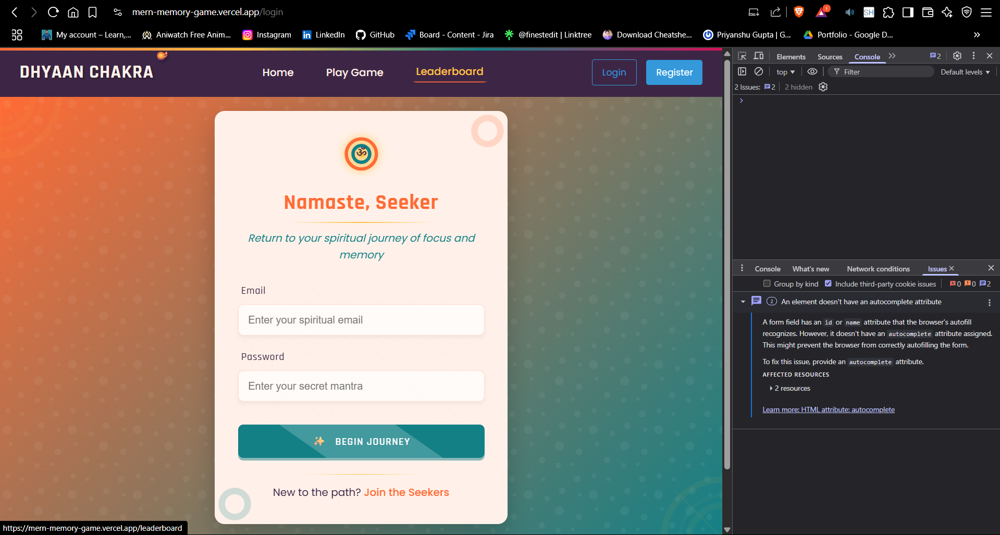

# Memory Matching Game with Score Tracker and Level Up

A full-stack web application created for the CodeCircuit Hackathon. This memory matching game includes user authentication, score tracking, leaderboards, and progressive difficulty levels.

## Features

- 👤 **User Authentication**: Register and login to track your progress and scores
- 🎮 **Memory Matching Gameplay**: Classic card-matching gameplay with beautiful UI
- 📈 **Score Tracking**: Points awarded based on level difficulty and moves made
- 🏆 **Global Leaderboard**: Compare your skills with other players
- ⬆️ **Level Progression**: Three increasing difficulty levels with more cards to match
- 📊 **Personal Stats**: Track your high scores and completed levels
- 🎵 **Background Music**: Immersive gameplay music with volume controls
- 📱 **Fully Responsive**: Optimized gameplay experience on desktop, tablet and mobile devices

## Tech Stack

- **Frontend**: React, React Router, Context API for state management
- **Backend**: Node.js, Express
- **Database**: MongoDB with Mongoose
- **Authentication**: JWT (JSON Web Tokens)
- **Styling**: Custom CSS with responsive design
- **Audio**: Web Audio API for background music and sound effects
- **Responsive Design**: Media queries for mobile, tablet, and desktop layouts

## Getting Started

## Some Screenshots


### Prerequisites

- Node.js (v14 or higher)
- MongoDB (local installation or MongoDB Atlas account)

### Installation

1. Clone the repository
   ```
   git clone <repository-url>
   cd mern-memory-game
   ```

2. Install dependencies for client, server, and root
   ```
   npm run install-all
   ```

3. Configure environment variables
   - Create a `.env` file in the server directory with the following:
   ```
   PORT=5000
   MONGO_URI=<your-mongodb-connection-string>
   JWT_SECRET=<your-secret-key>
   ```

4. Run the development server (both frontend and backend)
   ```
   npm run dev
   ```

5. Access the application
   - Frontend: http://localhost:3000
   - Backend API: http://localhost:5000

## How to Play

1. **Register/Login**: Create an account or log in to save your progress
2. **Start Game**: Click "Play Game" to begin (this will also start background music)
3. **Match Cards**: Click on cards to flip them and find matching pairs
4. **Complete Level**: Match all pairs to complete the current level
5. **Level Up**: Progress to more challenging levels with more cards
6. **Track Progress**: Check the leaderboard to see how you rank globally
7. **Audio Controls**: Use the sound icon in the navbar to toggle music on/off and adjust volume

## Game Levels

- **Level 1**: 6 pairs of cards (12 total)
- **Level 2**: 8 pairs of cards (16 total)
- **Level 3**: 10 pairs of cards (20 total)

## Screenshots

### Home Page


### Game Board


### Game Play - Finding Matches


### Level Complete


### Leaderboard


### User Authentication


## Development

- Run just the server: `npm run server`
- Run just the client: `npm run client`
- Run both: `npm run dev`

## Future Features

- Additional difficulty levels
- Time-based challenges
- Theme customization
- Multiplayer mode
- Achievement system

---

Created for CodeCircuit Hackathon | Happy Gaming! 🎮
